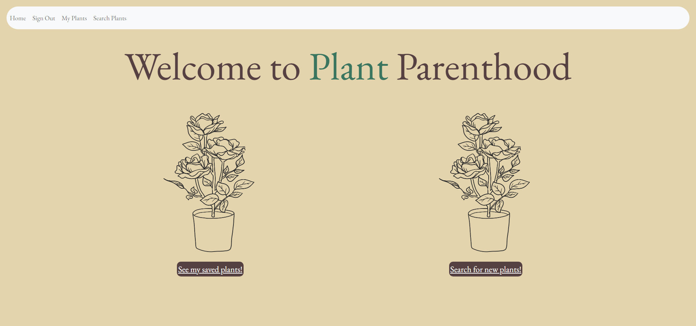

# PLANT-PARENTHOOD
## About Our Project

Our project was made to help plant lovers who want to know how to properly take care of a household plants, whether you are a newbie or an expert we are here to provide new tips in our lovely website. When the user signs up and is login, the user will be able to look up a common household plant and saved the ones they took interest in. To look up the facts the plants needs to stay alive, showing the tempature it needs, the lighting, and how much water. 

Our project was built by three future developers. That had a huge oppurtunity to practice more front and back end skills while using GitHub and Heroku.

Our concept was for any plant lover to have better knowledge to take care your at home plants to prevent them from dying. 
## Built With
The application was built with very basic yet challenging code.

Application use:

* Handlebares
* Javascript
* CSS
* HTML
* Cloudinary 
* Wireframe
* Node
* Bootstrap
* Insomnia
* Herkou

## Usage
When user loads the landing page, the homepage will show different navigations links to different sites. Signup/Login will have a template that will allow the user to create an account and/or login, while keeping the home button on the top of the navigation link.
When user is login, it will display "My plants page" from the plants that they have saved in their profile. When user wants to add/search for more plants, they can click on the navigation link "Search Plants". When on this page, user can see how to take care of their plants by showing their temperature, lighting and watering from the Api we are calling. This card will have a save button on the bottom of it to add to your profile. 

## Contributors
* [Rodd Azad](https://github.com/roddazad)
* [Haien Kim](https://github.com/hayni100)
* [Sabina Ceja-Siete](https://github.com/unisabi)

## License

See `MIT LICENSE` for more information.

## Acknowledments
* [API for Plants](https://rapidapi.com/rosoemawd/api/house-plants)
* [Bootstrap](https://getbootstrap.com/docs/5.3/components/card/)

